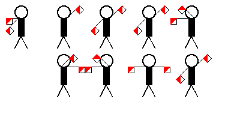

# spmhr
A program in Rust to generate stickman semaphore images from input text

### Places for improvement:
- Fix shit
- Dynamic width for stickmen
- Handle numerical digits for real
- Handle carriage return for real